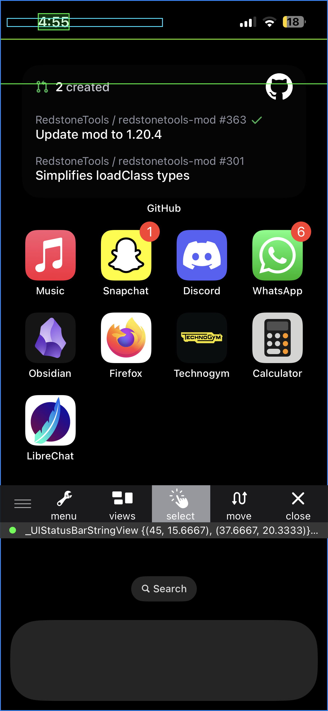
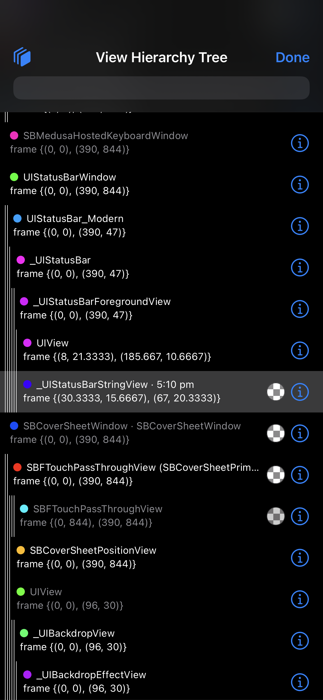
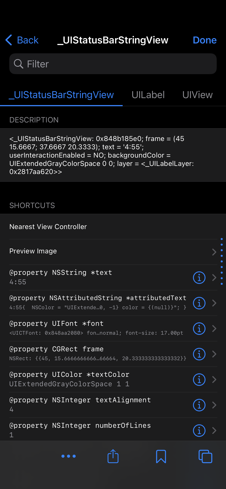
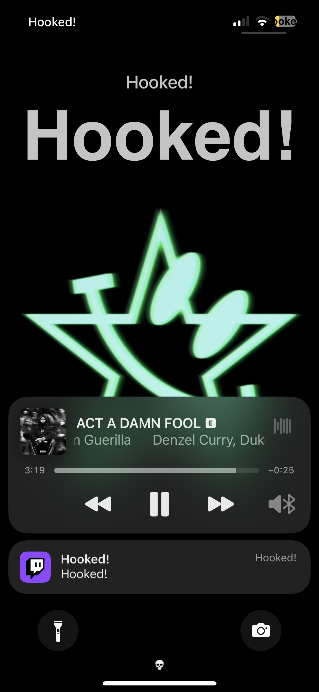
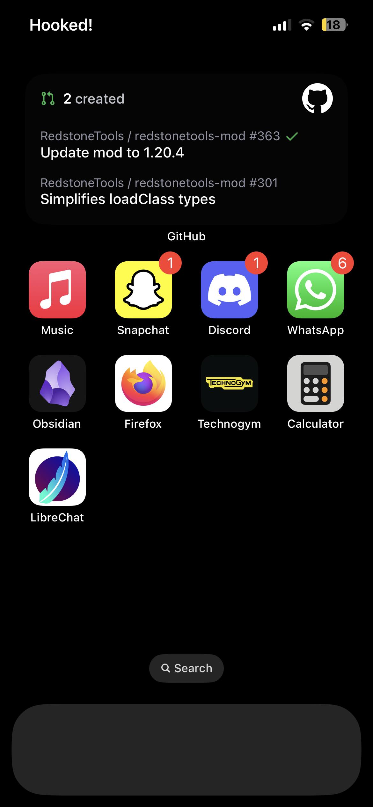

+++
title = 'Tweak Dev - Writing your first tweak'
date = 2025-01-27
weight = 3
summary = "Let's finally get started"

[cover]
image = "cover.png"
hiddenInList = true
+++

## What are we making?

We're going to start off simple
and change the time in the status bar to a fixed message, "Hooked!"

This will demonstrate the fundamentals you'll need to write more advanced tweaks in the future

## Reverse Engineering

Firstly, we need to learn *how* iOS actually displays the time, to do this we'll use FLEX.

Spawn flex. If you installed FLEXing you do that by holding the status bar,
if you installed Volume FLEX press both volume buttons at the same time

You'll see a menu like this:


### What do all these options do?

Well the left-most button allows you to move the toolbar around the screen
so it's not in the way of what you're doing.

The second button, labeled "menu", contains a variety of useful tools which we may end up using later
for now we'll leave it alone

"Views" allows you to see the view hierarchy of the current process.

"Select" let's you tap on a view for it to then show up in the "Views" menu.

"Recent" will show you options you've recently visited

And "Close" will obviously close flex.

### Finding the time view

Let's tap the "Select" option and then tap on the time in the status bar,
you'll see some colourful borders showing the views which the touch went through

If you haven't got fat fingers you'll see the time view outlined 
and underneath the flex toolbar the same colour and the text `_UIStatusBarStringView`,
this is the view responsible for the time.



Awesome! Now we know what we need to hook, but what *actually* is `_UIStatusBarStringView`,
it begins with an underscore so it's a private class, meaning we wont find much help online
and so we'll use flex to understand what it is, tap the "Views" option, it should scroll to the
same view automatically for you



Press the 'i' next to it.



Now you'll see a list of methods available on this class,
you'll also see along the top a row of classes which this one inherits.
As you can see `UILabel` is here, this is a public class which you've likely used before
if you've ever done UIKit development. If not don't worry, when I started out I hadn't done any prior iOS development either.

`UILabel` contains a property named `text`

`@property NSString *text;`

`@property` is shorthand for creating the following methods.

- `text() -> NSString`
- `setText(text: NSString)`

We want to overwrite the contents of this text,
so we'll be hooking `setText` and change the `text` parameter to our custom text.

## Setting up the tweak

Let's move over to our computer and start writing the tweak.

Firstly open a terminal, move to where you want to create your project
and run `$THEOS/bin/nic.pl`; this command, provided by the build system theos, which we set up in the last post,
is a project generator, it asks us a series of questions and then creates the project for us.

### nic.pl

Choose the option `iphone/tweak_swift`, for me that's number "21" but it could be different so check.

Next it'll ask for a project name, I'll call this "timeHook" but you can name it whatever

Then it will ask for a package name, this is the same name but must conform to some rules.
To avoid ambiguity it's standard for package names to include the developers bundle id prefix.
Bundle id's are typically domain names in reverse, so mine is `dev.rugmj`.
If you don't own a domain you can set it to whatever, like `com.yourusername`.
Then you append the package name, without spaces, after. So for me that's `dev.rugmj.timehook`.

After it'll ask for the author, you should make this the username you used in your bundle id with `(your@email.com)` after.
So people know where to contact you if they have issues.

Now you'll be asked what process you're tweaking, we're tweaking the process known as "SpringBoard"
which has a bundle id of `com.apple.springboard`, nic.pl assumes this as the large majority of tweaks are for springboard
so you can just press enter.

Finally you're asked for a list of processes which should be restarted when your tweak is installed, again we'll leave this as "SpringBoard".

### Project Structure

Now nic.pl has generated our project, let's have a look at what each file does.

```
├── control
├── Makefile
├── Package.swift
├── Sources
│   ├── timeHook
│   │   └── Tweak.x.swift
│   └── timeHookC
│       ├── include
│       │   ├── module.modulemap
│       │   └── Tweak.h
│       └── Tweak.m
└── timeHook.plist
```

`control` is responsible for package information which will show in your package manager like, sileo or zebra.
Everything here should be self explanatory, note that the architecture will be overwritten by theos
depending on what architecture we end up building for. The syntax you see in the depends section is theo's templating,
it'll fill in the correct version of orion we're using so we don't have to worry about that.

`Makefile` is the file which specifies how our tweak is built, it's where we'll configure our package for theos

`Package.swift` informs the swift compiler how to interact with our project

`timeHook.plist` is where we configure what processes our tweak should be injected into

The `Sources` directory is where we'll actually write our code, there's two subdirectories: `timeHook` and `timeHookC`.
We'll write swift code in `timeHook` and c/objc code in the `timeHookC` directory.

The `Tweak.m` file is where orion is initialised, the `include` subdirectory is where we can put any headers.

The `Tweak.x.swift` file is the entry point to our tweak, for this tweak this is where we'll spend most of our time

## Writing your first hook

### LSP

To take advantage of sourcekit, which we setup in the last post, you'll need to run these two commands first.

> [!NOTE]
> If you're using a mac vm these commands should be ran on your host **NOT** the vm

```sh
make commands && make spm
```

This will tell the LSP where to look for libraries and frameworks

### Writing

Open up the `Tweak.x.swift` file in you editor.

Create a new class, I'll call it `TimeHook`. Make it extend `ClassHook` from Orion.

We decided the view we want to hook is a `UILabel`, so put that inside of the generics:

```swift
class TimeHook: ClassHook<UILabel> {

}
```

Since `UILabel` is from `UIKit` we need to import it:

```swift
import UIKit

class TimeHook: ClassHook<UILabel> {

}
```

You'll get an error from the compiler complaining that it doesn't know what `UILabel` is.
We need to include the `Foundation` framework, there's two ways of doing this.

You can either import it the swift way by adding `import Foundation` to the top of your `Tweak.x.swift`
or you can include it in the `Tweak.h` file by adding `#include <Foundation/Foundation.h>`,
the way our project has been setup any objc code we write will be accessible from swift, this also applies to includes.
I prefer including it from objc as it'll translate the method names the same way orion will, avoiding any interop issues.
Though for this it shouldn't make any difference.

Okay, now we need to tell orion what method we want to hook, so we'll create the `setText method`:

```swift
class TimeHook: ClassHook<UILabel> {
    func setText(_ text: String) {

    }
}
```

Now we need to write our new implementation.

##### What do we actually want to happen?

We want to change the text to "Hooked!", so in other words we want to run `setText`.

But that's the method we're writing..?

Exactly, so we need to call the *original* implementation,
to do so in orion we use `orig` to get the original class, without any hooks applied.

So we'll call `orig.setText` with our new text as a parameter.

```swift
class TimeHook: ClassHook<UILabel> {
    func setText(_ text: String) {
        orig.setText("Hooked!")
    }
}
```

This is it! Our tweak is ready to be compiled and tested on-device.

We need this to be done on our mac vm, so i'll prefix the command with the `mac` alias we setup in the last post.
We also want to make sure theos is building our package in the right format for our jailbreak,
at the time of writing, that'll likely be rootless so we'll set the `THEOS_PACKAGE_SCHEME` flag to `rootless`

```sh
mac make do THEOS_PACKAGE_SCHEME=rootless
```

Hit enter and everything should compile properly and install on the device,
your device will respring and you should see something different.

## Somethings wrong..

Although our time has changed so has everything else!



If you look back at our code that makes perfect sense, at no point did we specify *which* `UILabel` we wanted to hook.
We need to narrow it down a bit, remember the class we saw earlier? `_UIStatusBarStringView`
from the name alone we can tell it's only going to be used in the status bar, let's swap `UILabel` for that in our `Tweak.x.swift` file

As you'd likely expect, the compiler has no idea what that class is. And as it's a private class we can't just import it.

So what do we do?

We need to trick the compiler into believing the class exists, to do so we'll create a stub in our `Tweak.h` header.

```objc
#import <UIKit/UIKit.h>

@interface _UIStatusBarStringView : UILabel
@end
```

Okay, now if we go back to `Tweak.x.swift` the compiler is no longer complaining
and we can try testing again.

This looks perfect now. right..?

Well no, not quite. If you open your control center
you'll see that this is also hooking the other items in the status bar.

There's no way we can differenciate the time label and the others with just the type system,
we'll need to some of our own filtering.

What does the time label have which is different to the other labels?

Well one thing you'll notice is that it's the only one with a ':' in, thats a perfect filter.
Let's use that!

```swift
class TimeHook: ClassHook<_UIStatusBarStringView> {
    func setText(_ text: String) {
        if !text.contains(":") {
            orig.setText(text)
            return
        }

        orig.setText("Hooked!")
    }
}
```

We'll check to see if the text contains a ':', if not we'll run the original implementation with the args we we were provided.

Otherwise we'll call it with our text.

Okay let's try it.



Finally, it's exactly how we want it.


## What can you do now?

Well, anything! But if you want some suggestions:

- You could try hooking the battery label instead.
- Make this tweak useful and add the seconds to the time.
- Maybe you don't care about the time, make it the current date instead.

## Conclusion

Now that you've written your first tweak
we can start learning how to add more advanced features.

In the next post I'll go over preference bundles so we can let your users customise your tweak!
